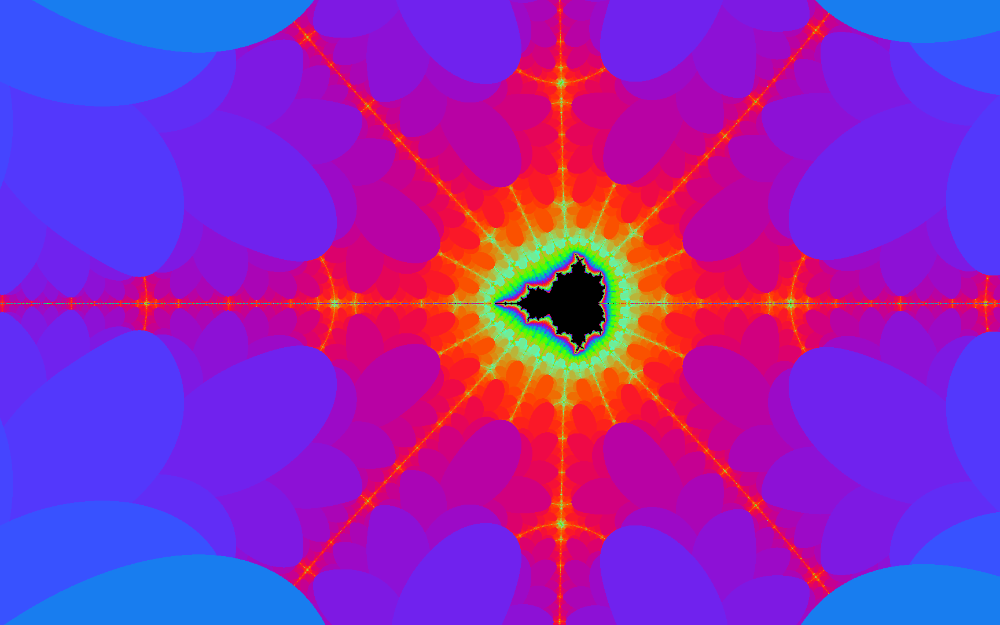
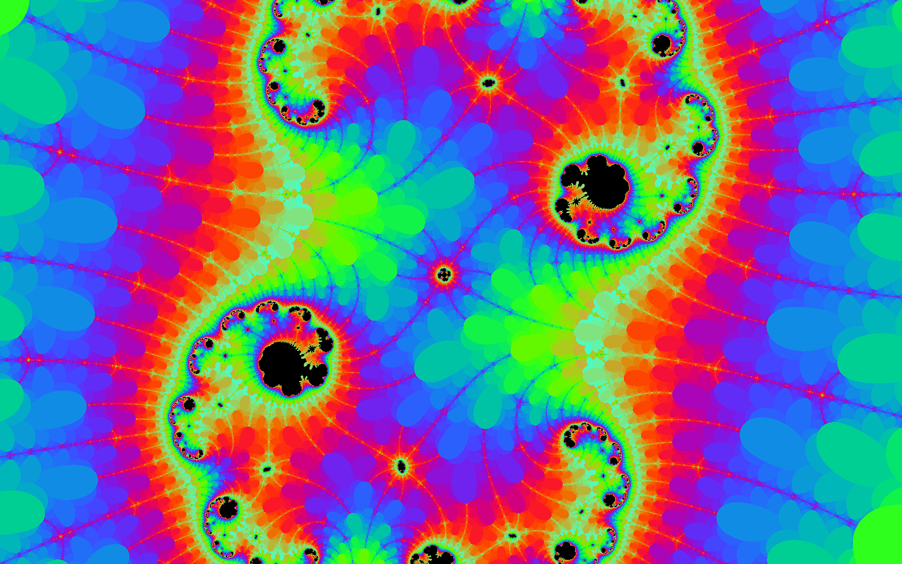
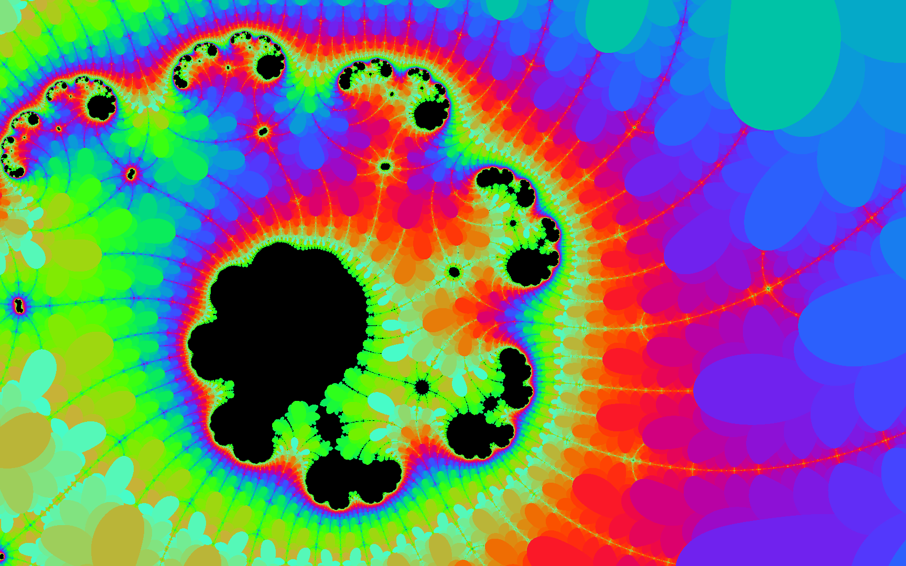
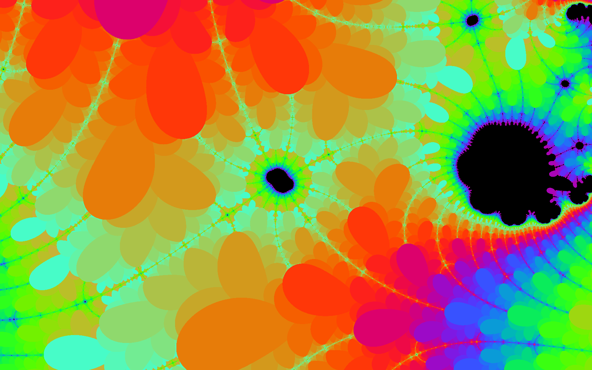

# 交互式Mandelbrot程序
包含两部分内容：

1、用鼠标操作mandelbrot集合, 由Python 3, PIL, 和 Tkinter开发. 颜色模版随机生成.

2、生成Julia和Mandelbrot动画程序

# 缺陷
复平面的区域如果在以下范围，放大的图像就不清晰了
复平面区域 (3.375077994860476e-14,2.098321516541546e-14), 迭代次数:1689
复平面区域 (3.375077994860476e-14,2.0971520002841706e-14), 迭代次数:1689

方案是使用 高精度第三方库

# 性能优化
1、采用Cython优化迭代部分代码，性能提高了10倍， 并暂时取消了多进程方式，也许多进程方式使用不当，反而不及不用多进程方式

2、增加了朱丽亚集合的绘制，同样进行了迭代的优化

3、初步优化了对颜色对处理

# 问题修复
1. 调整了窗口大小
2. 调整了交互的按键操作，避免鼠标点击按钮引起的卡顿
3. 增加了鼠标位置监控事件

## Usage
1. Install required modules with `pip install -r requirements.txt`.
2. Run the program with `python3 framework.py`
3. Control+left-click the image where you want to zoom in
4. Control+right-click the image to zoom out
5. Left-click to change the image colour-palette
6. Right-click to save the image
7. Left-click drag to shit view

## Commandline options
    -h, --help               Command-line help dialogue.
    -i, --iterations         Number of iterations done for each pixel. Higher is more accurate but slower.
    -x                       The x-center coordinate of the frame.
    -y                       The y-center coordinate of the frame.
    -m, --magnification      The magnification level of the frame. Scientific notation (e.g. 3E-4) is permitted.
    -wi, --width             The number of pixels wide the image is.
    -he, --height            The number of pixels high the image is.
    -s, --save               Flag to save the generated image.
    -c, --color_palette      Flag to use color palette.
    -spec_set                J for Julia, M for mandelbrot. default is M

## Mandelbrot Set feature rendered by this program

